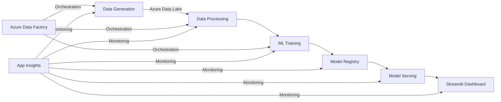

# Enterprise Revenue Prediction Pipeline

An end-to-end machine learning pipeline for ABC Renewables to forecast revenue across multiple renewable energy sites. The pipeline includes synthetic data generation, model training, automated predictions, and visualization.

## 🎯 Features

- Synthetic data generation for renewable energy sites (solar, wind, battery)
- Automated data processing and model training
- Multiple forecasting models (ARIMA, SARIMA, Prophet, Random Forest, LSTM)
- Interactive Streamlit dashboard with confidence intervals
- Full Azure Data Factory orchestration
- Application Insights monitoring
- Cost-optimized architecture (<$50/month)

## 🏗️ Architecture



## 📁 Repository Structure

```
/enterprise-revenue-prediction-pipeline
├── /data_generation/      # Synthetic data generation scripts
├── /data_processing/      # Data cleaning and preprocessing
├── /ml_training/         # Model training pipelines
├── /model_serving/       # Model deployment and serving
├── /streamlit_dashboard/ # Interactive visualization
├── /adf_pipelines/       # Azure Data Factory pipelines
├── /infra/              # Infrastructure as Code
├── requirements.txt     # Python dependencies
├── README.md           # This file
└── .gitignore         # Git ignore patterns
```

## 🚀 Getting Started

1. Clone the repository:
```bash
git clone https://github.com/nerdy1texan/RevenuePred.git
cd enterprise-revenue-prediction-pipeline
```

2. Create and activate virtual environment:
```bash
python -m venv venv
source venv/bin/activate  # Linux/Mac
.\venv\Scripts\activate   # Windows
source /c/Users/mauli/anaconda3/Scripts/activate #GitBash Initiatlize Conda 
conda activate revenuepred
```

3. Install dependencies:
```bash
pip install -r requirements.txt
```

4. Set up Azure credentials:
```bash
az login
```

5. Create `.env` file with required credentials:
```
AZURE_STORAGE_CONNECTION_STRING=your_connection_string
AZURE_TENANT_ID=your_tenant_id
AZURE_CLIENT_ID=your_client_id
AZURE_CLIENT_SECRET=your_client_secret
APPINSIGHTS_CONNECTION_STRING=your_connection_string
```

## 🔄 Pipeline Steps

1. **Data Generation**
   - Generate synthetic data for renewable sites
   - Store in Azure Data Lake

2. **Data Processing**
   - Clean and preprocess data
   - Feature engineering
   - Data validation

3. **Model Training**
   - Train multiple forecasting models
   - Model evaluation and selection
   - Model registration

4. **Model Serving**
   - Deploy best performing model
   - Real-time predictions
   - Batch predictions

5. **Visualization**
   - Interactive Streamlit dashboard
   - Revenue forecasts with confidence intervals
   - Performance metrics

## 📊 Data Schema

```python
{
    'Date': 'datetime64[ns]',
    'SiteID': 'string',
    'SiteName': 'string',
    'SiteType': 'string',  # solar, wind, battery
    'EnergyProduced_kWh': 'float64',
    'SpotMarketPrice': 'float64',
    'Revenue': 'float64',
    'WeatherCondition': 'string',
    'DowntimeHours': 'float64',
    'Temperature_C': 'float64',
    'WindSpeed_mps': 'float64'
}
```

## 💰 Cost Optimization

- Uses Azure free tiers where possible
- Automated resource scaling
- Efficient data storage patterns
- Budget alerts and controls
- Target monthly cost: <$50

## 🔍 Monitoring

- Application Insights integration
- Custom metrics and KPIs
- Automated alerts
- Performance monitoring
- Cost tracking

## 🧪 Testing

Run tests:
```bash
pytest tests/
```

## 📄 License

This project is licensed under the MIT License - see the LICENSE file for details.

## 👥 Contributing

1. Fork the repository
2. Create your feature branch
3. Commit your changes
4. Push to the branch
5. Create a Pull Request

## 📞 Support

For support, please contact the development team or create an issue in the repository. # RevenuePred
